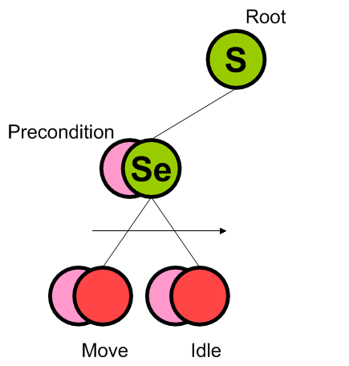

## 数据结构
之所以采用树形结构有以下好处：
- 易于扩展：每当需要扩展时，只需要在根节点插入一个代表新型为的节点即可，复杂度将是线性的。
- 结构十分清晰，甚至可以做到可视化、数据驱动化。
- 行为逻辑和状态数据分离，任何节点写好以后可以反复利用
- 重用性高，可用通过重组不同的节点来实现不同的行为树  

缺点：

- 行为决策必须每次从根节点重新开始执行。
- 任何一个简单的操作都必须要使用节点

## 节点关系

### 组合节点
1. 选择节点：在候选行为中选一个执行。子节点的条件越来越宽松。执行的是第一个满足条件的
2. 序列节点：一个个执行行为，候选行为条件越来越苛刻，直到不能执行。
3. 并行节点：多个行为同时执行。

### 装饰节点

装饰节点用来修改节点状态以满足特殊需求，通常根据需求定制，常用的有如下几种：结果取反、频率控制、错误处理等

### 子节点

1. 行为节点（叶子节点）：此节点向下连接表现层，通常将会执行具体的动画，亦或是一些行为代码。

## 细节阐述

### 决策流程

所有的节点可以粗糙的分为两种：控制节点和行为节点。

控制节点负责控制决策的走向，他往往不牵扯游戏代码，甚至可以将其封装定义成控制节点库。

进一步看，控制节点中的组合节点负责如何选择子节点。而子节点上的‘前提’把控的就是进入子节点的条件。

行为树就是通过行为节点，控制节点，以及每个节点上的‘前提’，把整个AI的决策逻辑描述了出来。

