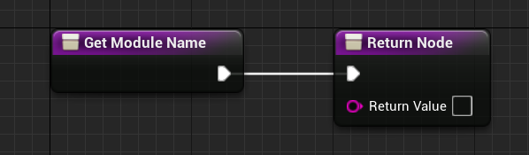

## Unlua的目的是什么

- 利用Lua的特性，将界面的编写过程转移到`Lua`侧。
- 使业务功能可以被热更新

## Unlua和引擎的绑定

核心思路是C++层和Lua层的注册：

LuaCore中实现C++层操作Lua的核心函数（这里实现了怎么操作Lua虚拟栈上的Lua数据），然后通过LuaContext将引擎层内容生成元表注册进Lua解释器。[具体原理看这里](Lua和C++交互.md)

#### 静态绑定

- C++方式

  我们自己的UClass需要实现 IUnluaInterface 接口，并且在**GetModuleName_Implementation()**函数里反馈lua文件相对路径（相对Content/Script）

- 蓝图方式

  需要在蓝图  ClassSetting-Detail-Interface 中添加 UnluaInterface ，然后选中GetMoudleName , 在 RetureNode 节点的return value框中指定 Lua文件相对路径（相对Content/Script，用 “.” 隔开）

#### 动态绑定

适用于动态生成的 Actors 或者 Objects。

##### Actor

```
local Proj = World:SpawnActor(ProjClass, Transform, ESpawnActorCollisionHandlingMethod.AlwaysSpawn, self, self.Instigator, "Weapon.BP_DefaultProjectile_C")
```

**“Weapon.BP_DefaultProjectile_C”**  是 Lua 文件路径

#### Object

```
local ProxyObj = NewObject(ObjClass, nil, nil, "Objects.ProxyObject")
```

**“Objects.ProxyObject”** 是 Lua 文件路径

## 互调

### Lua调用引擎层

unlua 提供了两种从 Lua 侧调用引擎层API的方式：

- 使用UE反射系统动态注册引擎层内容到Lua层：这种方式就是Lua通过调用元表内的函数指针。每次访问一个元表中不存在的函数名，就会通过引擎层反射获取实际函数指针，然后映射缓存在特定的元表中。
- 绕过反射系统静态导出引擎层，或者纯C++内容

### 引擎层调用Lua

Lua侧复写C++ UFunction函数后，并完成绑定后，Unlua会给对应的UClass增加或替换UFunction字节码。

## Q&A

- GetModuleName不填Lua路径，Unlua怎么处理?

  

  这一步属于C++和Lua的静态绑定过程。通过LuaContext.TryToBindLua进行绑定：

  

  1. 获取蓝图类/C++类的`GetModuleName`函数并强制执行，然后获取返回值（即lua文件相对路径）。如果`ModuleName`为空就使用蓝图类/C++类的类名进行绑定。

  2. 在真正绑定前要先找到`Lua Module`,Unlua自己实现了`require`方法(即Global_Require)：

     

     在这个方法里会将`ModuleName`返回字符串拼接上“Content/Script”的绝对路径，从而加载出`Lua Module`。

  3. 回到问题，会到Content/Script目录下去需按照`类名_C.lua`的Lua文件。找不到就报错。

- Lua侧实现的ReceiveBeginPlay怎么被引擎层调用到的？

  因为是重写了引擎层的函数，所以会在绑定的时候去寻找引擎层同名UFunction，如果UFunction是当前UClass的，就会替换UFunction的字节码，让引擎在执行的时候执行到Lua这边的一样逻辑。

- Unlua启动流程

  

### Unlua调试

https://blog.csdn.net/qq_36383623/article/details/110823999

### 扩展阅读

[原理细节（必读）](https://blog.csdn.net/qq_36383623/article/details/110823999)

>大纲：
>
>- unlua功能
>- 初始化流程及具体步骤
>- 绑定流程及具体步骤
>   - 将引擎层内容注册进元表，供Lua通过反射访问。
>   - 将Lua重写的函数 **替换**（如果函数是UClass）或 **添加**（如果函数是UClass的父类）对应UFunction, 这样引擎层就能执行和Lua侧一样的逻辑了（但并不是直接调用Lua函数）。
>   - 以上两点都遵循[C++/Lua交互原则](Lua和C++交互.md)
>- 反射及注册机制
>- C++调用unlua覆写blueprintevent流程

[从一个例子剖析Lua调用引擎层函数的过程: 此文的第三节](https://zhuanlan.zhihu.com/p/330790611)

> 摘要：
>
> - 为什么Unlua能调用到引擎层的C++函数？
>
> 1. Lua代码执行到UE4.UWdigetBlueprintLibrary的时候，执行了RegisterClass("UWdigetBlueprintLibrary")函数，做了这样几件事：
>    （1） UnLua框架代码在G表里创建了一个名为【“UWdigetBlueprintLibrary”的表】
>    （2）为这个表定义了【C++类型的__Index元方法】
>    （3）将这个类型的【FClassDesc】记录到了UnLua的反射信息库中
> 2. Lua代码执行到UE4.UWdigetBlueprintLibrary.Create的时候，执行了【C++类型的__Index元方法】，做了这样几件事：
>    （1）通过【FClassDesc】和函数名“Create”注册Field，组装了【UFunctionDesc】，记录到了UnLua的反射信息库中
>    （2）在【“UWdigetBlueprintLibrary”的表】创建了key为“Create”，value为【C++函数ClassCallUFunction + 函数反射信息UFunctionDesc指针的闭包】
>    （3）将【C++函数ClassCallUFunction + 函数反射信息UFunctionDesc指针的闭包】返回给Lua层
> 3. Lua代码执行到UE4.UWidgetBlueprintLibrary.Create(_G.GetCurrentWorld(), prefab, nil)的时候，执行了【C++函数ClassCallUFunction + 函数反射信息UFunctionDesc指针的闭包】，也就是执行了C++函数ClassCallUFunction，做了这样几件事：
>    （1）执行PreCall，根据【UFunctionDesc】和Lua参数，将Lua参数转换成C++参数，再根据【UFunctionDesc】反射信息，将C++参数写入到一个缓存区中
>    （2）执行 UObject::ProcessEvent(FinalFunction, Params)，参数FinalFunction是UFunction，参数Params是前面保存有C++参数的缓存区。ProcessEvent执行时，即调用了真正我们想调用的C++ Create函数，然后把C++返回值放入了Params缓存区中
>    （3）执行PostCall，从Params缓存区中读出C++返回值，转换成Lua返回值，Push进Lua栈，返回给Lua。
>
> 以上为整个过程，可以看到，上述1、2步都是在做准备工作，主要是收集反射信息，创建元表。第3步就是根据之前的准备工作，执行调用，这也是为什么在Lua中调用UE4.UWidgetBlueprintLibrary.Create，可以最终调用到C++的Create函数的原因，问题回答完毕。
>
> 另外，上述的第3步还做了Lua和C++对象之间的转换工作，并且上面一直没有展开讲Lua和C++对象之间是怎么转换的，现在我们开始展开，其实也是开始回答第二个问题。
>
> - Lua与C++对象转换
>
> 1. 在lua CallUE函数执行到 UObject::ProcessEvent(FinalFunction, Params)时，调用了C++Create函数，这时创建了一个新的UObject，触发了NotifyUObjectCreated回调，在这个回调中，根据UObject创建了Lua对象，并将Lua对象和UObject的映射关系保存在了Lua中的ObjectMap中
> 2. 在Lua CallUE函数执行到PostCall的时候，根据Params缓存区的返回值，在ObjectMap中索引到了对应的Lua对象，将这个Lua对象返回给了Lua
>
> 以此实现了Lua对象和C++对象之间的转换，Lua对象和C++对象之间的关系：
>
> Lua对象的元表是“UAGame.Utils.HelloWorldUMG”Lua模块，该Lua模块的元表是通过RegisterClass创建出的UObject元表，它里面包含了UObject的反射信息、Class_Index元方法等内容可供与C++交互，同时Lua对象的Object对象存有UObject的二级指针，可通过该Lua对象取到UObject。
>
> 因为元表的缘故，该Lua对象可以根据名字去匹配取用到对应UObject的属性、函数，进而实现Lua代码中调用到C++的接口。


