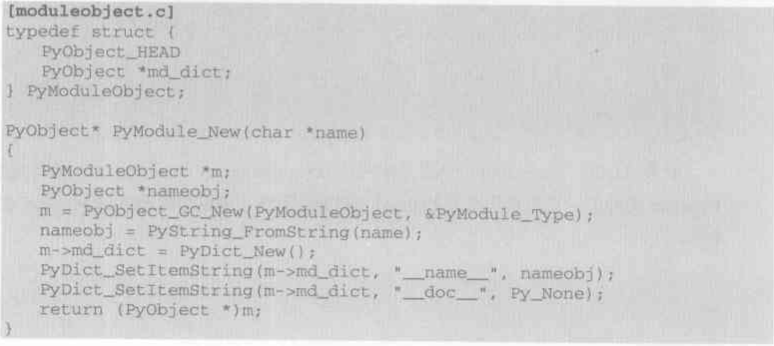

## module存在的意义

- 代码复用
- 划分名字空间

## 使用module方式

- import动态加载
- python module.py的形式直接加载

## Python运行环境初始化

- 线程环境初始化：这期间主要做的是**线程状态对象**（PyThreadState）和**进程状态对象**（PyInterperState）之间建立联系。
- 类型系统初始化
- 设置全局变量`builtin_object`
- 其他

## 系统module初始化

这一部分的初始化发生在上述第三点，通过**`_PyBuiltin_Init`**来设置。而第一个被创建出来的`module`是**`__builtin_`** `module`。后续所有加载出来的`module`都储存在一个**`PyDictObject`**对象中，同时这个对象被保存在进程状态对象上。

### **`_PyBuiltin_Init`**设置系统模块两步骤

- 创建用来是实现`module`的**`PyModuleObject`**对象，

- 设置`modules`，将所有类型对象全部加入新建的**`__builtin_`** `module`中。创建`module`的过程在源码中的**`Py_InitModule4`**。

- **`Py_AddModule(创建模块对象并加入模块集合)`** + **`PyModule_GetDict(获取PyObjectDict对象，用于存放模块和名字对应关系)`** + **`PyModule_New(在Py_AddMoudle中真正地创建一个类型为PyModuleObject的模块对象)`**。

  通过上述步骤，创建模块对象本身，这时模块对象会被加入前文提到的**`PyDictObject`**对象（对应sys.modules）中，由`Python`内部维护，里面存在了所有被加载到内存的模块对象。

### **`PyModule_NEW`**做了什么

- 创建一个`PyModuleObject`类型的对象。(我们看到他内部除了必有的`PyObject_HEAD`就是一个字典对象，所以说道底就是`PyDictObject`的包装。)

  

- 然后给这个dict对象初始化名字和描述。