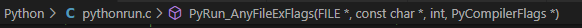
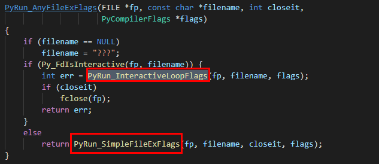

## 使用module方式

- import动态加载
- python module.py的形式直接加载

## Python运行环境初始化

- 线程环境初始化(`Py_InitializeEx`)：这期间主要做的是**线程状态对象**（PyThreadState）和**进程状态对象**（PyInterperState）之间建立联系; 
- 类型系统初始化
- 系统`module`初始化
- 其他

整个过程可以在源码`pythonrun.c`中的`Py_InitializeEx`函数中清晰的看到脉络。接下来围绕着问题主要探究模块初始化的部分。

## 系统module初始化

系统module初始化包括 `__builtin__模块`、`sys模块`，`__main__ 模块`，下文以内置模块的初始化举例。

这一部分的初始化通过**`_PyBuiltin_Init`**来执行，这个函数的第一步是创建一个`PyDictObject`后续所有加载的模块对象都会存在这里，同时这个**`PyDictObject`**对象被保存在进程状态对象上。而第一个被创建出来的`module`是**`__builtin_`** `module`。

### **`_PyBuiltin_Init`**设置系统模块两步骤

- 创建**`PyModuleObject`**对象来对应模块。
- 设置`modules`：将Python所有内置函数、模块名、模块描述加入新建的**`__builtin_`** `module`中。创建`module`的过程在源码中的**`Py_InitModule4`**。

**`Py_AddModule(创建模块对象并加入模块集合)`** + **`PyModule_GetDict(获取PyObjectDict对象，用于存放模块和名字对应关系)`** + **`PyModule_New(在Py_AddMoudle中真正地创建一个类型为PyModuleObject的模块对象)`**。

通过上述步骤，创建模块对象本身，这时模块对象会被加入前文提到的**`PyDictObject`**对象（对应sys.modules）中，由`Python`内部维护，**里面存在了所有被加载到内存的模块对象**。

### **`PyModule_NEW`**做了什么

- 创建一个`PyModuleObject`类型的对象。

  

- 模块包含的键值对信息都会保存在这个字典对象中。

  

在 `__builtin__ module`初始化后会依葫芦画瓢初始化`sys module`,之后 `PyThreasState`对象在内存中的状态是这样的：

这个`“modules”`就是前文多次提到的`PyDictObject`对象，**后续加载的模块对象都会存在这里**。而下面的`“sysdict”`和`“builtins”`单独开启空间来**复制**对应模块对象的内部字典，为什么是复制一份呢？

- 可以起到加速访问，因为Python对这两者的使用是频繁的。
- `modules`是一个可变对象，存在增删的情况，当加载的模块被动态销毁又要加载的时候，直接去复制容器中取，避免了重新创建。

### 设置系统模块搜索路径

文首提到过`module`的一个目的是为了划分名字空间（相当于门牌号），要想真正像`import xx`这样使用模块， 还需要设置他的搜索路径，即如何找到这个门牌号，进入对应的房间。这一部分对应的是源码中的`makepathobject`，会创建一个`PyListObject`来保存这列搜索路径，然后将这个列表对象保存到`sysdict`中。

### 创建`__main__ module`

在完成`import`环境的初始化之后，就会开始初始化`__main__ module`，也就是程序入口。

## 激活虚拟机

### 两种Python运行方式

（1）交互式运行方式：

​		首先会创建提示符，然后进入交互式环境。在交互式环境中，python将用户输入构造成抽象语法树（AST）,然后保存在`PyArea_New`创建的`PyArea`中，最终调用调用`run_mod`执行语句。

（2）文件运行方式：

​		这种方式会设置`__main__`模块的`__file__`属性，然后再将文件内容转换成AST，调用`run_mod`执行语句。

所以这两种方式是殊途同归的，只不过前者逐条读取输入构造AST，后者将文件内容一次性构造成AST。

### 启动虚拟机

上节中的`run_mod`接到构建好的AST后，交给`PyAST_Complie`去编译，最后产出一个前文提到过得`PyCodeObject`。完整的编译过程此文不述。

## 动态加载机制

前面我们了解到在初始化运行时的过程中回去初始化`import`环境，这是启动动态加载机制的第一步。在这部之前 python 运行时已经初始化好了系统模块（sys），后续动态加载出来的会统一存在`sys.modules`中, 当用于通过import机制去显示使用模块时，才从中取出给到`local`名字空间中。

### import 对应的指令做了些什么操作

`import`对应的字节码是`IMPORT_NAME`, 它主要将import动作相关的信息包装成一个PyTupleObject,然后与`builtin__import`函数指针在PyFunction_Call中进行函数调用。

### import结果是什么

去sys.modules中寻找名字`import`后接的名字，如果找到就将名字加到`local`名字空间，如果没找到，就去动态加载这个module（即创建一个module对象，对应源码中 `import.c -> load_module`）到sys.modules然后再加到`local`名字空间。除此之外，结合前文，我们知道，在`import`的过程中还将本地py文件进行了编译，在内存中创建了PyCodeObject（将代码中的操作转换成对应字节码），同时将编译结果以pyc文件保存在了硬盘上。

### import包结构

包结构是带`——init——.py`的文件夹，在python中包也以module对象的形式存在，并同样被存在`sys.modules`中。以`import A.B.c`的形式导入模块，python 会将名字符号拆分开，以从左往右的顺序查找对应模块是否存在，并且只会在上层包结构范围中查找（即在A中查B，在B中查c）。

### from  import

`import`会将导入模块的名字加到`local`名字空间，模块内的内容依旧在原来模块中，而`from import`则能够精准的将模块中的内容都复制到`local`名字空间中。

### import重命名

即改变当前模块对象维护的`PyDictObject`中的（名字-对象）映射关系，将原来的模块名字改成自定义名字，但值得注意的是，这一改变并不会作用到`sys.modules`的`PyDictObject`上。

## 问题总结

