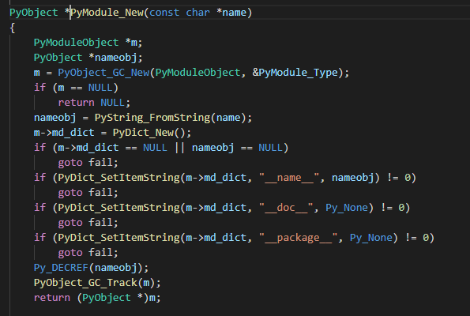
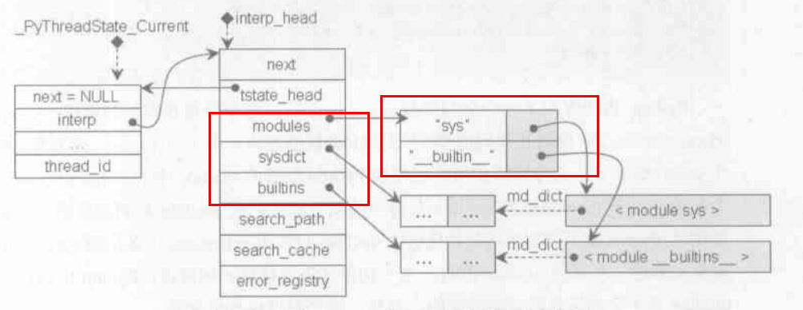

## module存在的意义

- 代码复用
- 划分名字空间

## 使用module方式

- import动态加载
- python module.py的形式直接加载

## Python运行环境初始化

- 线程环境初始化(`Py_InitializeEx`)：这期间主要做的是**线程状态对象**（PyThreadState）和**进程状态对象**（PyInterperState）之间建立联系; 
- 类型系统初始化
- 系统`module`初始化
- 其他

## 系统module初始化

系统module初始化包括 builtin模块、sys模块，下文以内置模块的初始化举例。

这一部分的初始化通过**`_PyBuiltin_Init`**来执行，这个函数的第一步是创建一个，后续所有加载的模块对象都会存在这里，同时这个**`PyDictObject`**对象被保存在进程状态对象上。而第一个被创建出来的`module`是**`__builtin_`** `module`。

### **`_PyBuiltin_Init`**设置系统模块两步骤

- 创建**`PyModuleObject`**对象来对应模块。
- 设置`modules`：将Python所有内置函数、模块名、模块描述加入新建的**`__builtin_`** `module`中。创建`module`的过程在源码中的**`Py_InitModule4`**。

**`Py_AddModule(创建模块对象并加入模块集合)`** + **`PyModule_GetDict(获取PyObjectDict对象，用于存放模块和名字对应关系)`** + **`PyModule_New(在Py_AddMoudle中真正地创建一个类型为PyModuleObject的模块对象)`**。

通过上述步骤，创建模块对象本身，这时模块对象会被加入前文提到的**`PyDictObject`**对象（对应sys.modules）中，由`Python`内部维护，里面存在了所有被加载到内存的模块对象。

### **`PyModule_NEW`**做了什么

- 创建一个`PyModuleObject`类型的对象。

  (我们看到他内部除了必有的`PyObject_HEAD`就是一个字典对象，所以说道底就是`PyDictObject`的包装。)

  

- 模块包含的键值对信息都会保存在这个字典对象中。

  

在 `__builtin__ module`初始化后会依葫芦画瓢初始化`sys module`,之后 `PyThreasState`对象在内存中的状态是这样的：

这个“modules”就是前文多次提到的`PyDictObject`对象，后续加载的模块对象都会存在这里。而下面的`“sysdict”`和`“builtins”`单独开启空间来**复制**对应模块对象的内部字典，为什么是复制一份呢？

- 可以起到加速访问，因为Python对这两者的使用是频繁的。
- `modules`是一个可变对象，存在增删的情况，当加载的模块被动态销毁又要加载的时候，直接去复制容器中取，避免了重新创建。

### 设置模块搜索路径

文首提到过`module`的一个目的是为了划分名字空间（相当于门牌号），要想真正像`import xx`这样使用模块， 还需要设置他的搜索路径，即如何找到这个门牌号，进入对应的房间。

## 问题总结

