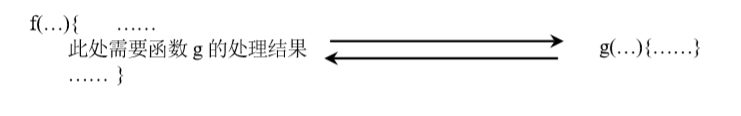
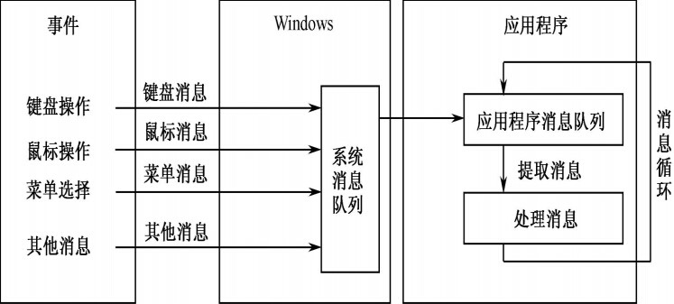
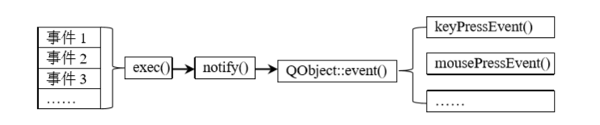

[TOC]

## 源起QObject

作为所有Qt对象模型的核心，QObject足以在讨论所有Qt对象子类前被拿出来讨论一番。它是许多强大机制的源泉。接下来会讨论其相关的几个相对重要的内容。

1） QObject组成的树叫做对象树，做客户端的对对象树这个概念肯定不陌生，通过这棵对象树我们能轻易得获取任意一个对象

2） QObject提供了信号槽机制，使得对象通信变得更加解耦，灵活。（另外开篇讨论）

3） 通过QObject能够获取到元对象（MetaObject），利用反射机制获取到该类型相关的所有信息。

4） 使用QObject实现多线程。（详见网页资料txt），[另,手册对应讲解](https://doc.qt.io/qt-5/qobject.html#thread-affinity)

## 元对象系统和反射机制

### 之于反射的运用

- 什么是反射机制

  ​	反射机制就是指在`运行时`能够`动态的`获取到类对象的的所有类型信息、属性、成员函数等信息的一种机制。主要为了能够给C++这种静态语言增加一些类似动态语言的特性。

- 元对象系统提供的功能之一是为 QObject 派生类对象提供运行时的类型信息及数据成 员的当前值等信。程序可以获取 QObject 派生类对象所属 类的名称、父类名称、该对象的成员函数、枚举类型、数据成员等信息，其实这就是 反射机制。

- 那么元对象，是什么东西？

  它其实是QT中用来表述对象结构的另一个对象。

### Qt实现反射机制的方法

- 通过一系列类来对对象进行各方面描述。其中MetaObject类描述了QObject及其派生子类的所有元信息，可以说QMetaObject类的对象是Qt中的元对象

- 对对象成员进行描述。一个对象包括数据成员、函数成员、构造函数、枚举成员等。在 Qt 中，这些成员分别使用了不同的类对其进行描述，比如函数成员使用类 QMetaMethod 进行描述，属性使用 QMetaProperty 类进行描述等。然后使用 QMetaObject 类对整个类对象进行描述。

  ```c++
  //比如要获取成员函数的函数名
  QMetaMethod qm = metaObject->method(1);    //获取索引为 1的成员函数 
  qDebug()<<qm.name()<<"\n";    //输出该成员函数的名称。
  ```

### 使用反射机制的条件

- 需要继承QObject, 并在类中加入Q_OBJECT宏

- 注册成员函数：若希望普通成员函数能够被反射，需要在函数声明之前加入`QObject::Q_INVOKABLE` 宏。

- 注册成员变量：若希望成员变量能被反射，需要使用 `Q_PROPERTY` 宏。

- 示例如下所示：

  ```C++
  //1 .继承 QObject 
  class TestObject : public QObject
  {
      // 2.声明Q_OBJECT
      Q_OBJECT 
      //3. Q_PROPERTY 注册成员变量
      Q_PROPERTY(QString text READ text WRITE setText NOTIFY textChange) 
      //4. 注册的成员变量能够响应自定义的signals textChange
      Q_PROPERTY(QString text MEMBER m_text NOTIFY textChange)
  public:
      TestObject(QObject* parent);
      ~TestObject();
      void init();
      //------
      //5.注册类的成员函数
      Q_INVOKABLE QString text(); 
      Q_INVOKABLE void setText(const QString& strText); 
      void g1();    //注意：此函数不会被反射。 
      QString m_text; //类的成员变量
  signals:
      void textChange(); //自定义的signals
  public slots:
      void textslot(){qDebug()<<"textslot"<<endl;} //自定义的signals响应的槽函数
  };
  ```

### 示例简述

- Q_OBJECT 宏展开之后有一个虚拟成员函数 meteObject()，该函数会返回一个指向 QMetaObject 类型的指针，其原型为

  ` virtual const QMetaObject *metaObject() const; `

  因为启动了元对象系统的类都包含 `Q_OBJECT` 宏，所以这些类都有含有 `metaObject()` 虚拟成员函数，通过该函数返回的指针调用 `QMetaObject` 类中的成员函数，便可查询 到`QObject `及其派生类对象的各种信息。    

- Qt 的moc 会完成以下工作：

  为Q_OBJECT 宏展开后所声明的成员函数的成生实现代码 ；

  识别 Qt 中特殊的关键字及宏，比如识别出 Q_PROPERTY 宏、Q_INVOKABLE 宏、slot、signals 等 

- 调用时，就可以通过获取类对象持有的元对象来获取类型信息了。

## 信号和槽原理

### 简述

此所谓的对象之间的通信，从程序设计语言语法角度来看就是函数调用的问题，只不过是某个对象 的成员函数调用另一个对象的成员函数而已。事实上，信号和槽其实是观察者模式的一种实现。

### 函数调用的几种形式



- f 函数中直接调用 g 函数获取结果。

  存在的问题：1）f 需要知道 g 函数的存在； 2) 如果 g 函数也是调用其他函数处理结果，就形成嵌套

- 使用回调函数。在 f 函数中使用函数指针，在需要的时候取调用，这样就不会被函数名限制。

- Qt信号和槽机制：

  1）创建一个信号，并在需要调用外部函数的时候发送这个信号

  2）关联过这个信号的槽（函数），做出响应的反应

### 信号的创建和槽函数的关联/断开

QObject的各种派生都预定义了各自的信号和槽，当然开发者也能定义自己的信号。

PYQT中定义信号需要派生自QObject类型，而在C++中`signals:`则用来指明信号的定义区域，同时可以使用访问修饰符来限定作用域。

PyQt中槽函数的定义只要和信号匹配上签名就行；在C++中同样要先声明`slots`区域。

在信号和槽在关联时，通过`connect`函数来关联；通过`disconnect`来取消关联，取消关联的槽函数将不再响应信号。

## 属性系统

Qt的属性系统实际上是为了给静态语言提供一共动态设置属性的功能，对于pyqt来说意义不大。

属性系统中的属性和数据对象是两个不同的概念。

## 事件循环

### 基础事件与消息的关系

事件由输入产生，消息是由事件翻译而来。产生的消息会先由系统捕获，放在操作系统消息队列中，然后再拷贝到对应程序的消息队列。操作系统会为每个应用程序维护一个消息队列和一个消息循环，每当消息队列中有消息了，系统就会将消息封装再分发。



### 事件与信号

事件的来源：操作系统，自定义事件

事件既可以同步使用（sendEvent）也可以异步使用(postEvents)，而使用信号和槽总是同步的。事件的另一个特点是可以被过滤。

Qt中使用QEvent来描述事件，其中包含事件的大量信息。

Qt中每当产生一个事件，都会被转换成对应信号，因此不用处理底层事件。

### 事件的分类

- 自发事件：窗口系统产生，置于系统队列中，由事件循环一个个处理
- 发布的事件（Posted events): 由Qt或应用程序生成，由实际应用程序排队并通过各自事件循环处理。
- 发送的事件（Sent events): 由应用程序产生并直接派发到目标对象，不经过事件循环。

### Qt事件循环的流程

- Qt会自行捕捉事件，事件会被分发到事件队列中，当队列中有事件时就不停的将队列中的事件发送给需要处理事件的对象，当队列为空时就阻塞地等待事件。
- 如果捕获到一条事件，就会将事件分发到目标对象，如果没被目标对象处理，就会不断向目标对象的父节点传递，直到被处理或到根。
- 事件循环由`QCoreApplication::exec()`开启，直到`QCoreApplication::exit()`终止，所以事件循环伴随着Qt的整个运行周期。在此期间，主循环会先处理发布型事件，再处理自发事件，最后处理自发事件期间产生的已发布事件。`注意：发送的事件不由事件循环处理，该类 事件会被直接传递给对象。 `

- 事件的分发由` QCoreApplication::notify()函数`处理。
- 对象调用`QObject::event()`函数接收事件，是`QObject`对象处理事件的入口。



### 事件处理三种套路

- 不同类型的事件由不同事件处理器处理，如上图所示由event分派。
- 给目标对象指定事件过滤器，过滤出只关心的事件
- Qt调用`QApplication`来发送一个事件，我们可以重写`QApplication::notify`来获取事件并进行处理，但是这种方式不利于扩展。

### 事件处理方式

 从以上三个处理模式我们可以看出，这是一个不断完善的过程，从3个模式的讨论中我们不难找到可以进行事件处理的地方，而这几个地方就是我们在编写程序的时候可以控制事件处理的地方。
1、event()函数
首先是控制事件分发的event()函数，我们可以改写该函数，改变事件的分发方式，这样就可以改变事件处理的结果。
2、notify()函数
实现该函数可以截获事件，并对事件加以处理，但是该方法很少用，这里不做介绍。
3、事件过滤器
实现自己的事件过滤器就可以改变事件处理的方法和结果，这个方法比较常用。
4、事件处理器
事件处理的最后一步，也是最重要的一步就是事件处理器，因为它才是真正进行事件处理的地方，我们可以改写以有的事件处理器，以此改变已有事件的处理方法和处理结果，我们也可以定义自己的事件类型和相应的事件处理器。
注意：以上四种方法中最常用的是后两者：事件过滤器和事件处理器。

## 对象树

### 为什么要使用对象树

GUI通常是存在父子关系的，让父控件维护一系列子控件，使用树的结构能够更加直观的去描述父子关系，同时能够通过父节点更好的管理子节点。

### 组合模式与对象树

- 组合模式指的是把类的对象组织成树形结构，这种树形结构也称为对象树。

- 主要作用是可以通过根节点对象间接调用子节点中的虚函数，从而可以间 接的对子节点对象进行操作。 

- 基本思想是使用父类类型的指针指向子类对象，并把这个指针存储在一个数组 中(使用容器更方便)，然后每创建一个类对象就向这个容器中添加一个指向该对象的指针。 

- 生命周期

  基本规则：父对象在销毁时会一起销毁子对象

  手动删除对象：会把待删除对象从父对象的子对象列表中移除，避免父对象销毁时二次销毁，

  当一个对象被销毁时，会发送destroy信号，可以捕捉该信号避免对QObject对象的悬垂引用。

  

