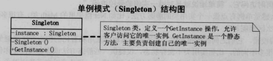

#### 简介

单例类， 通过构造私有化确保了在一个应用中只产生一个实例.
单例模式的实现有好几种，常用的用：

- 懒汉式：线程不安全
- 饿汉式：线程安全
- 双重校验锁

#### 结构

**优点**
　　由于单例模式在内存中只有一个实例， 减少了内存开支， 特别是一个对象需要频繁地创建、 销毁时， 而且创建或销毁时性能又无法优化， 单例模式的优势就非常明显。
由于单例模式只生成一个实例， 所以减少了系统的性能开销， 当一个对象的产生需要比较多的资源时， 如读取配置、 产生其他依赖对象时， 则可以通过在应用启动时直接产生一个单例对象， 然后用永久驻留内存的方式来解决。
　　单例模式可以避免对资源的多重占用， 例如一个写文件动作， 由于只有一个实例存在内存中， 避免对同一个资源文件的同时写操作。
　　单例模式可以在系统设置全局的访问点， 优化和共享资源访问， 例如可以设计一个单例类， 负责所有数据表的映射处理。

**缺点**
　　单例模式一般没有接口， 扩展很困难， 若要扩展， 除了修改代码基本上没有第二种途径可以实现。 单例模式为什么不能增加接口呢？ 因为接口对单例模式是没有任何意义的， 它要求“自行实例化”， 并且提供单一实例、 接口或抽象类是不可能被实例化的。 当然， 在特殊情况下， 单例模式可以实现接口、 被继承等， 需要在系统开发中根据环境判断。
　　单例模式对测试是不利的。 在并行开发环境中， 如果单例模式没有完成， 是不能进行测试的， 没有接口也不能使用mock的方式虚拟一个对象。
　　单例模式与单一职责原则有冲突。 一个类应该只实现一个逻辑， 而不关心它是否是单例的， 是不是要单例取决于环境， 单例模式把“要单例”和业务逻辑融合在一个类中。

**使用场景**
　　在一个系统中， 要求一个类有且仅有一个对象， 如果出现多个对象就会出现“不良反应”， 可以采用单例模式， 具体的场景如下：
　　要求生成唯一序列号的环境；
　　在整个项目中需要一个共享访问点或共享数据， 例如一个Web页面上的计数器， 可以不用把每次刷新都记录到数据库中， 使用单例模式保持计数器的值， 并确保是线程安全的；
　　创建一个对象需要消耗的资源过多， 如要访问IO和数据库等资源；
　　需要定义大量的静态常量和静态方法（ 如工具类） 的环境， 可以采用单例模式（ 当然， 也可以直接声明为static的方式） 。

**注意点**
1. 为什么多线程下不锁定实例？
因为加锁时不能确定是否已经实例出了对象，所以不能锁定对象
2. 为什么要双重锁定？
因为每次获取实例时都需要lock影响性能，双重锁定排除已有实例的情况。
3. 如何选择？
懒汉式在自己被第一次访问时实例对象，同时要考虑多线程情况添加双重校验锁；
饿汉式在自己被加载时就实例对象，会竞争系统资源；
具体视情况而定。