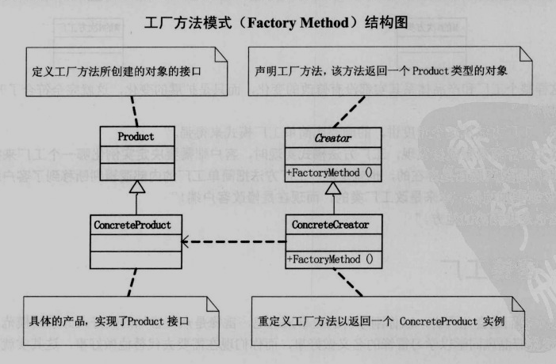

**结构**

**解耦方式**
定义了一个创建对象的接口，但由子类决定要实例化哪个类。将实例化的过程**延后**到子工厂类

也就是说 每个子工厂创建特定产品。

**简单工厂和工厂模式区别联系**

简单工厂将客户端和具体对象解耦，客户端只负责获取工厂给出来的实例就行，具体生产哪个对象交给工厂去判断。

但是简单工厂的缺点表明其违反了开放-封闭原则。

工厂模式进一步将简单工厂的switch解耦开，将对象实例放在特定子工程中。

缺点是，调用方要知道有那些工厂子类，然后决定实例化具体的工厂。

生活中的例子：
 - 由于pattern工厂发展的很好，订单激增，同时其中推出的两种网红糖果更是走俏。不断增加的糖果品类，以及每次都要根据进货单配货严重得降低了工厂效率。
 于是小工厂决定开分工厂，专门制作几种热销的糖果。于是，进货商只要去对应的厂商后就能得到对应产品。

 **优点**
 易扩展

**缺点：**
这样一来，扩展性得到了充分的提升，但是会造成子类规模的急速扩大：不光要添加子类产品，还要添加对应的子类工厂。
由于实例化延后，导致客户端必须知道有哪些子类工厂，不满足最小知道原则。

这个问题在某些时候（子类与子类之间可以合并处理的情况）可以通过**抽象工厂**可以解决。

另外，如果想把生成出来的多个对象用*容器存放*起来，到时候统一进行一些处理，这就有些像**建造者模式**了。