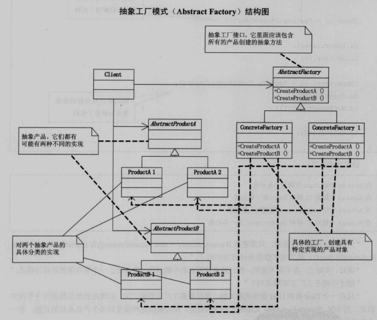

#### 结构

#### 抽象工厂与工厂模式区别

- 抽象工厂模式创建的是**对象家族**，也就是很多对象而不是一个对象，并且这些对象是**相关的**，也就是说必须一起创建出来。
- 而工厂方法模式只是用于创建一个对象，这和抽象工厂模式有很大不同。

抽象工厂模式用到了工厂模式来创建单一对象，AbstractFactory 中的 createProductA() 和 createProductB() 方法都是让子类来实现，这两个方法单独来看就是在创建一个对象，这符合工厂模式的定义。

至于创建对象的家族这一概念是在 Client 体现，Client 要通过 AbstractFactory 同时调用两个方法来创建出两个对象，在这里这两个对象就有很大的相关性，Client 需要同时创建出这两个对象。

从高层次来看，抽象工厂使用了组合，即 Cilent 组合了 AbstractFactory，而工厂方法模式使用了继承。
Client中可以通过更换子类工厂，就能实例化其他产品组。

举个例子：
- 有很多兵工厂（AbsSubFactory）,他们都拥有造兵的功能（继承自AbstractFactory）
- 每个兵工厂都能造几种士兵（继承自AbstractProduct），各兵工厂造之间造的士兵各不同。
- 士兵在不同兵工厂中具体为（TypeAProduct\TypeBProduct。。。。）
- 指挥所（Client）随时需要调遣兵工厂制造士兵:通过修建兵工厂A（AbsSubFactory）培养（override Method）1、2、3类士兵；如果想培养（override Method）4、5、6类士兵就修建兵工厂B（AbsSubFactory）。
- 理解：客户端获取不同产品族下的产品对象，并且调用这些产品的同名方法。这样就能实现产品族之间的切换，同时不需要客户端改变调用方法。

生活中的例子：
    开设分工厂的pattern工厂又遇到了发展瓶颈：他们发现进货商每次都要往返不同的工厂获取产品使得成本增加，直接导致糖果售价上升，导致市场降温，糖果不好卖了。
    于是工厂决定将分工厂的功能都整合一下，每个工厂生产部分销量接近的糖果。这样进货商就可以减少寻找不同工厂的过程。

1）应用场景
需要将对象的创建和使用解耦的场合。
且，系统有多个产品族，每次只使用其中一个产品族的产品。
且，产品等级结构稳定，不会增删新旧产品等级结构。

**应用举例**：切换不同数据库。

2）优点
将一系列具有某种共性的对象统一在一起，使得选择提前。
高层模块可以方便地通过更换具体工厂来改变所需创建的产品对象类型。
具体工厂可以方便地更换想要创建的产品类型。
增删产品族十分方便。

3）缺点
缺点：增删产品等级结构十分麻烦。需要产品等级结构足够稳定。
解决方案：将结构与行为分离，将产品族和产品等级结构转化为数据结构进行管理。