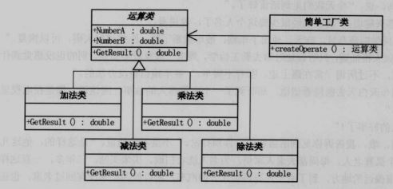

简单工厂设计模式是创建型模式的一种，他避免了创建过程与客户类之间的耦合，将创建过程统一集中在工厂类中。这样就带来了以下几点好处：

- 松耦合
- 易扩展

**缺点**
- 每次扩展都要修改工厂类

**优点**
解耦，避免在客户端出现硬编码的分支结构。
客户端只要知道简单工厂的存在就行，满足最小知道原则。

生活中的例子：
    一个叫Pattern的小工厂能够制造好几种糖果，进货商只管把单子给工厂，从工厂拿产品就行。但是工厂每次都要看进货商的单子才决定交付那种糖果。

应用场景：
- 当需要对一类相同性质的物体操作时

**工厂模式**
简单工厂的问题是每次都要根据客户端传参来确定实例对象，这之中的分支无法避免，对于能够预测客户端传参，或者分支比较固定的情况这个问题不是很名显。一旦无法控制，这个模式显然不合适。
那么有没有办法，直接获取工厂的实例对象呢？这就可以使用工厂模式。 

