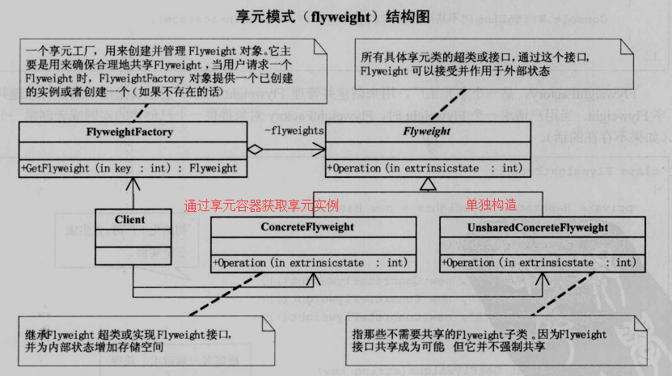

## 解决什么问题？

只是因为数据不同而生成大量实例对象，造成内存浪费。

### 解决方案

维护一个享元工厂统一创建并持有所有不同的享元类，不同的享元有各自的**内部状态**（接口的不同实现、持有的对象等）；**外部状态**取决使用的享元，又外部提供，外部状态是不共享的。

### 情景理解

CSDN博客众多，不同博客用的模板不同（享元类型丰富）；登陆前获取 <u>用户账号密码</u>（外部状态），通过账号数据获取具体的模板（获取指定享元），像是个性鲜明的模板信息（内部状态）。对于CSDN来说只需要维护博客模板，具体内容由 <u>数据</u> 区分。

### 什么时候用？

当以下所有的条件都满足时，可以考虑使用享元模式：
* 一个应用程序使用了大量的对象。
* 完全由于使用大量的对象，造成很大的存储开销。
* 对象的大多数状态都可变为外部状态。
* 如果删除对象的外部状态，那么可以用相对较少的共享对象取代很多组对象。
* 应用程序不依赖于对象标识。由于Flyweight对象可以被共享，对于概念上明显有别的对象，标识测试将返回真值。

## 注重点

减少同类型对象的重复创建。

### 注意！

设计享元类需要控制好粒度问题，一旦把不应共享的数据也添加到享元类中，会使对象数据互相篡改导致紊乱。

### 优缺点

优点：
享元模式可以避免大量非常相似对象的开销。在程序设计时，有时需要生成大量细粒度的类实例来表示数据。如果能发现这些实例数据除了几个参数外基本都是相同的，使用享元模式就可以大幅度地减少对象的数量。

缺点：
1）享元模式使得系统更加复杂。为了使对象可以共享，需要将一些状态外部化，这使得程序的逻辑复杂化。
2）享元模式将享元对象的状态外部化，而读取外部状态使得运行时间稍微变长。