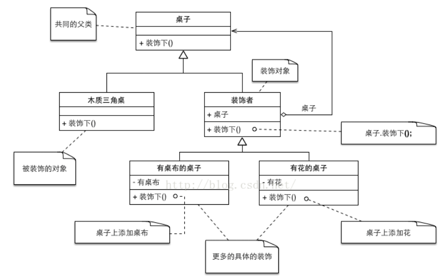

## 解决什么问题？

在不影响原有函数功能的前提下，动态地给一个对象添加一些额外的职责。

### 实现原理

装饰者通过持有被装饰者对象，然后重载待修饰函数，这样在调用被装饰者的同名函数时可以做一些额外操作。

## 注重点

扩展性，重用性

## 和其他模式之间的区别

- 与代理模式

  相同：在真实对象的方法前面或者后面加上自定义的方法。

  区别：

  1. 具体实现上：装饰器模式持有被装饰对象；代理模式中代理实例化真实对象。
  2. 确定时机：使用代理模式，代理和真实对象之间的的关系通常在编译时就已经确定了；而装饰者能够在运行时被递归地构造。  
  3. 可见性：装饰者可以让使用者直观的知道增强了那些内容（作为装饰者子类）；使用代理模式只知道调用，不知道代理里面具体做了什么。
  4. 装饰者模式：在不改变接口的前提下，动态扩展对象的功能；代理模式：在不改变接口的前提下，控制对象的访问

- 与组合模式区别

### 和python装饰器

是对装饰模式的应用，不光能装饰类还能装饰函数。