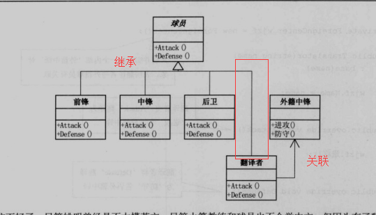

## 解决什么问题?

需要的东西就在眼前，但是不能用，短时间都不能去改造它，就用 “ 适配 ” 的方式去使用它。

带着两点问题：

- 什么叫需要的东西就在眼前却不能用
- “ 适配 ” 的方式是怎样的方式

### 情景理解

NBA选姚明要去打篮球，但是姚明短时间学不会英语，就配了一个随身翻译，这样姚明能在新环境中依旧发挥打篮球的作用。

### 实际情景

**原有系统模块A**数据和行为都正常，这个时候有**其他系统模块B**想要使用**A**的对外接口却发现接口匹配不上（例如**B**通过工厂模式统一调用固定接口，这时两边的接口名都不好改），适配器模式相当于在中间将**原模块A**的接口包装一层，从而达到接口匹配的目的。

### 解决方案

对不符合调用者需求的已有接口多包装一层，供调用者使用。

## 什么时候用？

- 维护时，两个系统模块都不太好修改，起到兼容的作用。
- 需要使用第三方接口时

## 注重点

兼容

### 优点

1. 适配器模式可以让两个没有任何关系的类在一起运行，只要适配器这个角色能够搞定他们就成。   

2. 增加了类的透明性
想想看，我们访问的Target目标角色，但是具体的实现都委托给了源角色，而这些对高层次模块是透明的，也是它不需要关心的。   
3. 提高了类的复用度，源角色在原有的系统中还是可以正常使用，而在目标角色中也可以充当新的演员。
4. 灵活性非常好
某一天，突然不想要适配器，没问题，删除掉这个适配器就可以了，其他的代码都不用修改，基本上就类似一个灵活的构件，想用就用，不想就卸载。
