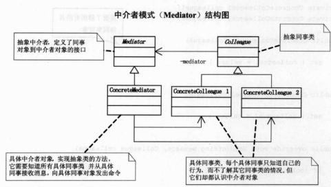

## 解决什么问题

用一个中介对象来封装一系列的对象交互。中介者使各对象不需要显式地相互引用，从而使其耦合松散，而且可以独立地改变它们之间的交互。

## 实际情景

遵循迪米特法则（最少知道）：如果两个类不必直接通信，那么这两个类就不应当发生直接的交互。如果其中一个类需要调用类一个类的某个方法，可以通过第三者转发这个调用。

## 解决方法

## 什么时候用

- 现有功能正常，但是模块内类间调用关系错综复杂难以理解。这时候可以使用中介者模式将调用的拓扑关系调整成星形连接。
- 一个对象引用其他很多对象并且直接与这些对象通信,导致难以复用该对象。
- 想定制一个分布在多个类中的行为，而又不想生成太多的子类。

## 注重点

## 区分
- 和代理模式的区别

- 和外观模式的区别
