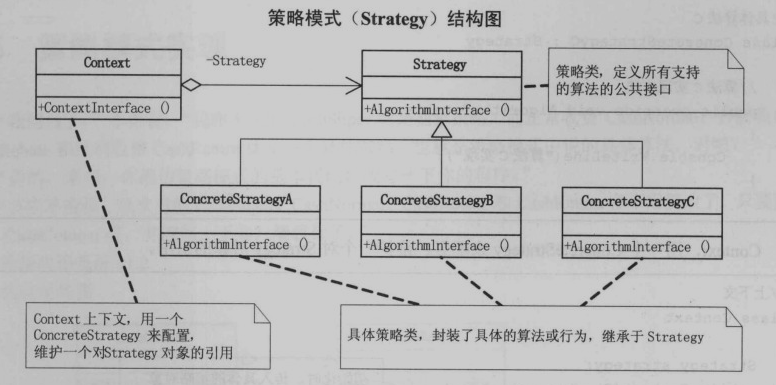

### 解决什么问题

定义一组算法，将每个算法都封装起来，并且使它们之间可以互换。

### 角色

策略模式使用的就是面向对象的**继承**和**多态**机制，非常容易理解和掌握，我们再来看看策略模式的三个角色：

　　●Context封装角色
　　它也叫做上下文角色，起承上启下封装作用，屏蔽高层模块对策略、算法的直接访问，封装可能存在的变化。

　　●Strategy抽象策略角色
　　策略、算法家族的抽象，通常为接口，定义每个策略或算法必须具有的方法和属性。

　　●ConcreteStrategy具体策略角色
　　实现抽象策略中的操作，该类含有具体的算法。

Strategy模式将逻辑（算法）封装到一个类（Context）里面，通过**组合的方式**将具体算法的实现在**组合对象**中实现，再通过**委托的方式**将抽象接口的实现委托给组合对象实现。将算法的逻辑抽象接口（DoAction）封装到一个类中（Context），再通过委托的方式将具体的算法实现委托给具体的Strategy类来实现（ConcreteStrategeA类）。

　　Stragegy类，定义所有支持的算法的公共接口。
　　ConcreteStrategy类，封装了具体的算法或行为，继承于Strategy。
　　Context类，用一个ConcreteStrategy来配置，维护一个对Strategy对象的引用。

#### 优点

　　●算法可以自由切换
　　这是策略模式本身定义的，只要实现抽象策略，它就成为策略家族的一个成员，通过封装角色对其进行封装，保证对外提供“可自由切换”的策略。

　　●避免使用多重条件判断
　　如果没有策略模式，我们想想看会是什么样子？一个策略家族有5个策略算法，一会要使用A策略，一会要使用B策略，怎么设计呢？使用多重的条件语句？多重条件语句不易维护，而且出错的概率大大增强。使用策略模式后，可以由其他模块决定采用何种策略，策略家族对外提供的访问接口就是封装类，简化了操作，同时避免了条件语句判断。

　　●扩展性良好
　　这甚至都不用说是它的优点，因为它太明显了。在现有的系统中增加一个策略太容易了，只要实现接口就可以了，其他都不用修改，类似于一个可反复拆卸的插件，这大大地符合了OCP原则。

#### 缺点

　　●策略类数量增多
　　每一个策略都是一个类，复用的可能性很小，类数量增多。

　　●所有的策略类都需要对外暴露
　　上层模块必须知道有哪些策略，然后才能决定使用哪一个策略，这与迪米特法则是相违背的，我只是想使用了一个策略，我凭什么就要了解这个策略呢？那要你的封装类还有什么意义？这是原装策略模式的一个缺点，幸运的是，我们可以使用其他模式来修正这个缺陷，如工厂方法模式、代理模式或享元模式。

#### 应用场景

　　●多个类只有在算法或行为上稍有不同的场景。

　　●算法需要自由切换的场景。
　　例如，算法的选择是由使用者决定的，或者算法始终在进化，特别是一些站在技术前沿的行业，连业务专家都无法给你保证这样的系统规则能够存在多长时间，在这种情况下策略模式是你最好的助手。

　　●需要屏蔽算法规则的场景。
　　现在的科技发展得很快，人脑的记忆是有限的（就目前来说是有限的），太多的算法你只要知道一个名字就可以了，传递相关的数字进来，反馈一个运算结果，万事大吉。

#### 策略模式 VS 状态模式

首先来看一下两者的通用类图：

我们发现这两个模式很相似，都是通过Context类封装一个具体的行为，都提供了一个封装的方法，是高扩展性的设计模式。

但根据两者的定义，我们发现两者的区别还是很明显的：策略模式封装的是不同的算法，算法之间没有交互，以达到算法可以自由切换的目的；

而状态模式封装的是不同的状态，以达到状态切换后行为随之发生改变的目的。而状态之间往往有关联性。

这两种模式虽然都有变换的行为，但是两者的目标却是不同的。

**不同：**

● Context角色的职责不同
　　两者都有一个叫做Context环境角色的类，但是两者的区别很大，策略模式的环境角色只是一个委托作用，负责算法的替换；而状态模式的环境角色不仅仅是委托行为，它还具有登记状态变化的功能，与具体的状态类协作，共同完成状态切换行为随之切换的任务。

● 解决问题的重点不同
　　策略模式旨在解决内部算法如何改变的问题，也就是将内部算法的改变对外界的影响降低到最小，它保证的是算法可以自由地切换；而状态模式旨在解决内在状态的改变而引起行为改变的问题，它的出发点是事物的状态，封装状态而暴露行为，一个对象的状态改变，从外界来看就好像是行为改变。

● 解决问题的方法不同
    策略模式只是确保算法可以自由切换，但是什么时候用什么算法它决定不了；而状态模式对外暴露的是行为，状态的变化一般是由环境角色和具体状态共同完成的，也就是说状态模式封装了状态的变化而暴露了不同的行为或行为结果。

#### 命令模式 VS 策略模式

**目的上的区别**
策略模式的意图是封装算法，它认为“算法”已经是一个完整的、不可拆分的原子业务（注意这里是原子业务，而不是原子对象），即其意图是让这些算法独立，并且可以相互替换，让行为的变化独立于拥有行为的客户；

而命令模式则是对动作的解耦，把一个动作的执行分为执行对象（Reciver）、执行行为（Commond），让两者相互独立而不相互影响。

**关注点不同**
　　策略模式关注的是算法替换的问题，一个新的算法投产，旧算法退休，或者提供多种算法由调用者自己选择使用，算法的自由更替是它实现的要点。换句话说，策略模式关注的是算法的完整性、封装性，只有具备了这两个条件才能保证其可以自由切换。

　　命令模式则关注的是解耦问题，如何让请求者和执行者解耦是它需要首先解决的，解耦的要求就是把请求的内容封装为一个一个的命令，由接收者执行。由于封装成了命令，就同时可以对命令进行多种处理，例如撤销、记录等。