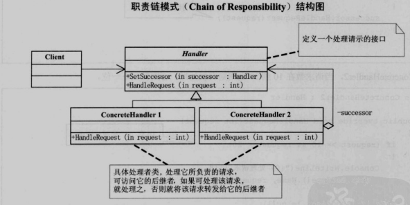

**简介**
使多个对象都有机会处理请求，从而避免了请求的发送者和接受者之间的耦合关系。将这些对象连成一条链，并沿着这条链传递该请求，直到有对象处理它为止。

**好处**
增加了给对象指派职责的灵活性责任链模式非常显著的优点是将请求和处理分开。
请求者可以不用知道是谁处理的，处理者可以不用知道请求的全貌。两者解耦，提高系统的灵活性。

**缺点**
责任链有两个非常显著的缺点：
一是性能问题，每个请求都是从链头遍历到链尾，特别是在链比较长的时候，性能是一个非常大的问题。
二是调试不很方便，特别是链条比较长，环节比较多的时候，由于采用了类似递归的方式，调试的时候逻辑可能比较复杂。 

**注意**
链中节点数量需要控制，避免出现超长链的情况，
一般的做法是在Handler中设置一个最大节点数量，
在setNext方法中判断是否已经是超过其阈值，超过则不允许该链建立，避免无意识地破坏系统性能。
