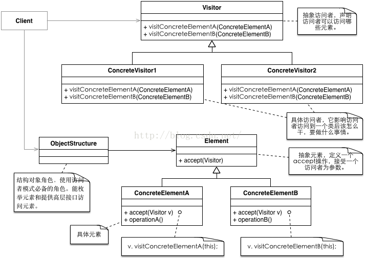
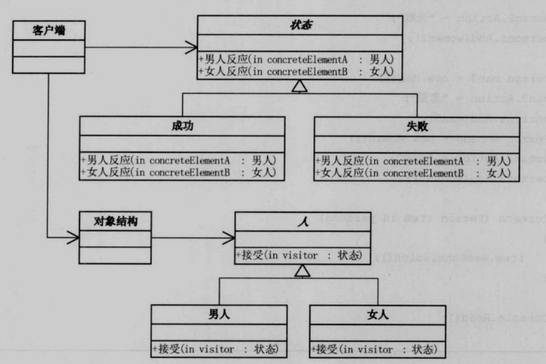

### 结构图



### 展示

```
#传统
client需求:
将所有具体对象加入集合，
遍历集合统一执行某个操作。
具体对象：
需要去实现不同的操作，供调用方遍历执行不同操作
问题：子类都要去实现不同的操作，操作和子类强耦合

#访问者解决方案
将操作抽象成类（visitor），传入原来对象(element)作为操作需要的参数，这样就能复用操作的逻辑，同时用传入参数体现区别。
这样，客户端需要示例具体访问类，在遍历element对象的时候将访问类传入即可。
```

### 例子



一种Visitor类中定义所有对应Element的操作，不同Element接受Visitor类，调用Visitorzh中对应自己的操作。

### 好处

解耦操作与实体，复用代码。

### 坏处

增加一种实体就要在一类操作中增加对应的操作来接受实体。

### 用途

适用于数据结构稳定，但是操作异变的情况。即隔离变化。