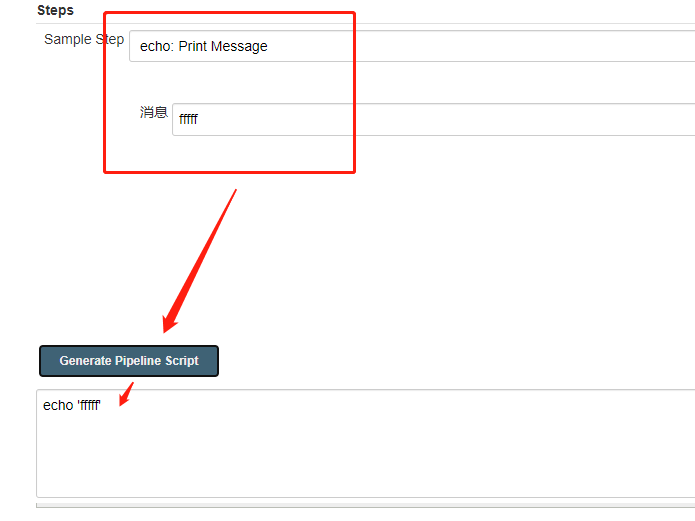

### **意义**

[DevOps意义：15分钟](https://linux.cn/article-11307-1.html)

内容提要：

- CICD框架：例如 jenkins。 管控整体流程，增强自动化
- 源代码控制管理，例如 svn。CI/CD 工具能够自动化进行源代码检入检出以及完成成员之间的协作。
- 自动化构建工具，例如 Gradle,Make。将配置文件放进源代码控制管理系统中，并让 CI/CD 工具构建它。
- 提供web服务，使流水线能用。
- 代码覆盖测试，例如 PyTest, JUnit。CI/CD 工具能够集成这些工具并将测试过程自动化进行。提前报错。
- 可选步骤：
- 容器
- 中间件自动化工具

### **宏观上了解CICD流程**

[流程图：预计10分钟](https://blog.csdn.net/duanlei123456/article/details/87454053?utm_medium=distribute.pc_relevant.none-task-blog-searchFromBaidu-5.control&depth_1-utm_source=distribute.pc_relevant.none-task-blog-searchFromBaidu-5.control)

### **虚拟实践**

[如何使用jenkins搭建流水线，15分钟](https://zhuanlan.zhihu.com/p/90612874)

内容提要：

- 流水线是一系列作业
- jenkins通过编码来指定这条流水线要做哪些事情

### **jenkins手册速览**

[使用 Jenkinsfile](https://www.jenkins.io/zh/doc/book/pipeline/jenkinsfile/)

对照现有案例查阅，如果整个教程全看完大约两小时。必看的有如下部分：

- [词汇表](https://www.w3cschool.cn/jenkins/jenkins-m5cv28qt.html)
- [jenkinsFile使用](https://www.w3cschool.cn/jenkins/jenkins-qc8a28op.html)
- [Pipeline语法](https://www.w3cschool.cn/jenkins/jenkins-jg9528pb.html)
- [环境参数（可配置参数）](https://www.w3cschool.cn/jenkins/jenkins-w9ga28n8.html)

### **pipelinefile样板空壳**

```
pipeline {
    agent { 执行任务的机器或容器 }
    environment {  全局设置  }
    
    stages {    有哪些阶段
        stage('阶段1') {
            steps {   当前阶段有哪些步骤}
        }
        
        stage('阶段2') {
            steps {   }
        }
    }
    post { 执行结束后做些什么事情 }  
}
```

### **pipelinefile中语法自动生成**

构建页 -> PipelineSyntax -> generate





生成了代码之后，我们就能直接粘贴到pipeline script 块中了。

### **jenkins常用groovy来编写脚本**

[groovy语法](https://www.w3cschool.cn/groovy/groovy_if_statement.html)（速览主要部分）

[groovy快速入门](https://www.jianshu.com/p/5d30f1443aa6)

### **拓展阅读**

[官网](http://www.jenkins.org.cn/category/install)

[全局变量参考](http://jenkins.yoozoo.com/view/产品技术中心/job/umt_developer_ios_test/pipeline-syntax/globals)

[安装jenkins](https://blog.csdn.net/qq_37138756/article/details/103559827)

[gitlabs上关于devops的介绍](https://gitlab.uuzu.com/help/topics/autodevops/index.md)