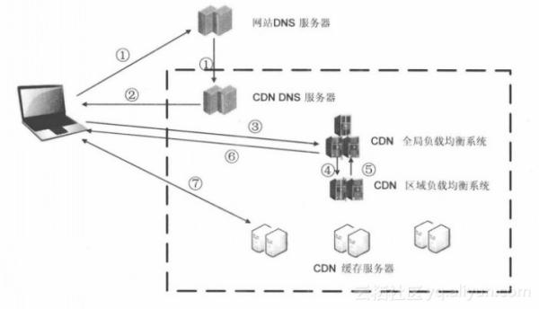
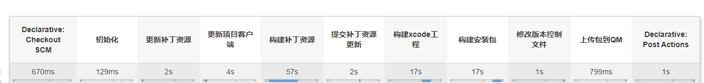

### CDN

[什么是CDN](https://www.zhihu.com/question/36514327?rf=37353035): **核心思想就是将离用户较远的源站内容，缓存在离用户较近的站点。从而达到降低源站访问压力，以及将内容加快分发到用户的目的。**

> 在游戏构建构建中，有一步是提交补丁资源到CDN。

**基础架构：**

最简单的CDN网络由一个DNS服务器和几台缓存服务器组成：

1. 当用户点击网站页面上的内容URL，经过本地DNS系统解析，DNS系统会最终将域名的解析权交给CNAME指向的CDN专用DNS服务器。
2. CDN的DNS服务器将CDN的全局负载均衡设备IP地址返回用户。
3. 用户向CDN的全局负载均衡设备发起内容URL访问请求。
4. CDN全局负载均衡设备根据用户IP地址，以及用户请求的内容URL，选择一台用户所属区域的区域负载均衡设备，告诉用户向这台设备发起请求。
5. 区域负载均衡设备会为用户选择一台合适的缓存服务器提供服务，选择的依据包括：根据用户IP地址，判断哪一台服务器距用户最近；根据用户所请求的URL中携带的内容名称，判断哪一台服务器上有用户所需内容；查询各个服务器当前的负载情况，判断哪一台服务器尚有服务能力。基于以上这些条件的综合分析之后，区域负载均衡设备会向全局负载均衡设备返回一台缓存服务器的IP地址。
6. 全局负载均衡设备把服务器的IP地址返回给用户。
7. 用户向缓存服务器发起请求，缓存服务器响应用户请求，将用户所需内容传送到用户终端。如果这台缓存服务器上并没有用户想要的内容，而区域均衡设备依然将它分配给了用户，那么这台服务器就要向它的上一级缓存服务器请求内容，直至追溯到网站的源服务器将内容拉到本地。

### Android

**配置keystore**

避免受别的同签名应用影响。

示例中，将keystore保存在工程中的Keystore目录下。

Keystore pass：使用密码；

Keyalias name：渠道别名，不同渠道可以对应不同的key pass

然后在ChannelConfig文件中同步配置。

### IOS

ios打包前需要先生成xcode工程，通过xcode工程进行打包。另外，打包时需要注意以下两点：

- 需要给app设置证书和授权文件。在`archive`保存后，进行`distribute`。

- 打包需要手动打包，这样完成之后，去输出目录下找到`ExportOption.plist`，这个文件中记录了手动打包时设置的打包参数。在自动构建中需要这个文件。
- 正对不同渠道可以使用不同证书和授权文件，所以生成的`plist`也会不同，自动构建的时候通过渠道来选择对应的`plist`文件。

**[IOS账号及证书](https://www.cnblogs.com/lteal/p/10823698.html)**

账号类型：个人开发者、公司开发者，企业账号（不考虑,不能发布appstore）

证书：开发阶段和发布阶段都有不同的证书和文件：

> 1、Certification(证书)

> 证书是对电脑开发资格的认证，每个开发者帐号有一套，*分为两种*：

> ​      1)Developer Certification(开发证书)：提供进行真机测试权限，可生成副本

> ​          安装在电脑上提供权限：开发人员通过设备进行真机测试。可以生成副本供多台电脑安装；

> ​       2)Distribution Certification(发布证书)： 提供发布iOS程序权限，不可生成副本

> ​          安装在电脑上提供发布iOS程序的权限：开发人员可以制做测试版和发布版的程序。不可生        成副本，仅有配置该证书的电脑才可使用；

> 2、Provisioning Profile(授权文件)

> 授权文件是对设备如iPod Touch、iPad、iPhone的授权，文件内记录的是设备的UDID和程序的App Id，**即：使被授权的设备可以安装或调试Bundle identifier与授权文件中记录的App Id对应的程序**。开发者帐号在创建授权文件时候会选择App Id，（开发者帐号下App Id中添加，单选）和UDID（开发者帐号下Devices中添加最多100个，多选）。授权文件分为两种，对应相应的证书使用：

> ​        1)Developer Provisioning Profile(开发授权文件)

> ​     在装有开发证书或副本的电脑上使用，开发人员选择该授权文件通过电脑将程序安装到授权文件记录的设备中，即可进行真机测试。注意：确保电脑有权限真机调试，即安装了开发证书或副本；在开发工具中程序的Bundle identifier和选中使用的授权文件的App Id要一致；连接调试的设备的UDID在选中的授权文件中有记录。

> ​       2)Distribution Provisioning Profile(发布授权文件)

> ​     在装有发布证书的电脑上（即配置证书的电脑，只有一台）制做测试版和发布版的程序。发布版就是发布到App Store上的程序文件，开发者帐号创建授权文件时选择store选项，选择App Id，无需选择UDID；测试版就是在发布之前交给测试人员可同步到设备上的程序文件，开发者帐号创建授权文件时选择AdHoc，选择App Id和UDID；只有选中的UDID对应的设备才可能安装上通过该授权文件制做的程序。

> 3、Keychain(开发密钥)

> ​     安装证书成功的情况下证书下都会生成Keychain，上面提到的证书副本（导出证书重新命名）就是通过配置证书的电脑导出Keychain（就是**.p12文件**）安装到其他机子上，让其他机子得到证书对应的权限。Developer Certification就可以制做副本Keychain分发到其他电脑上安装，使其可以进行真机测试。*注意：Distribution Certification只有配置证书的电脑才可使用，因此即使导出Keychain安装到其他电脑上，其他电脑也不可能具有证书的权限。*

#### 基础Jenkins构建流程讲解

- CheckOut SCM:拉取CICD pipelinefile ,执行file
- 初始化阶段：一般是初始化本次构建的相关内容，比如本次构建的名称，本地路径设置等。
- 更行补丁资源：更新补丁资源，确保后续构建补丁的资源是最新的
- 更新项目客户端：即更新项目客户端目录中的内容
- 前期更新完后就进入了构建阶段，最先开始构建补丁资源：即构建AB
- 提交补丁资源更新：构建好后要将AB提交到资源仓库，然后更新补丁版本，这样客户端在校验资源的时候就会触发更新。（客户端拉去资源的地方实际是CDN）
- 构建Xcode工程 + 构建安装包(安卓没有构建Xcode工程)：这部就是打包过程。如果是选择打小包（那打出来的安装包里只包含基础资源，剩余资源在进入游戏后触发热更新下载）。
- 修改版本控制文件：更新最新的打包数据，并同步版控服。
- 上传到QM：上传新安装包，提供下载测试。
- post 构建后处理：往往做一些构建结果的通知。

### pipeline文件编写

`jenkins pipeline`文件采用的变成语言是`groovy`, 但不完全是`groovy`语法。在流程控制、管道等基础描述语法采用`jenkins`自己的组织方式。