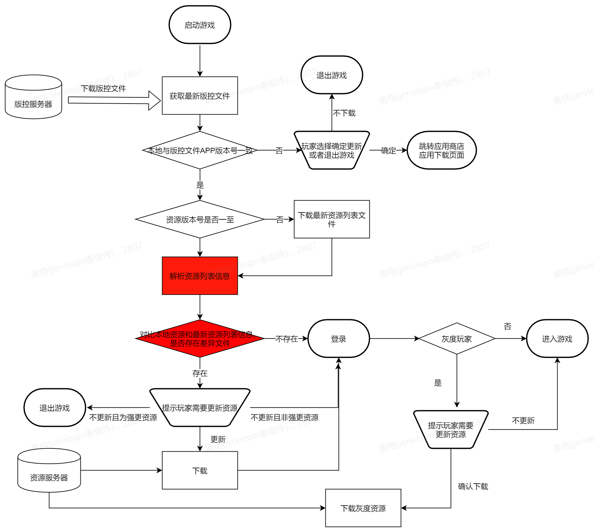

### 打包，构建

在构建补丁资源后一般会自动提升版本号，而在构建完app大版本安装包后会提升app大版本号。这两处构建在结束后，都会各自修改打包机上本地的版控文件（当然，前提是先更新在修改），然后将构建好的新补丁资源提交到资源仓库，将版控文件提交到版控服。

### 热更新基本流程

当有了版控文件发生修改后， 客户端在进入游戏后会请求版控服版本信息，确认是否需要更行，下图阐述了热更新的基本过程：

#### 版控字段

其中，版控文件中一般记录如下字段：

- 最新App版本号：版本号前三位，代表app的大版本号。当大版本号发生变化时，通常需要换包；
- App内部版本号：版本号第四位，通常用于表示app渠道号；版控服可以根据此标记，即使发生大版本变化时，决定需不需要下发更新。
- 资源版本号：通常表示App最新使用的资源版本。当资源版本发生变化的时候，客户端就需要去资源仓库下载新资源。
- 资源仓库地址：这个地址往往是CDN地址。当确认需要更新资源的时候，下载需要根据玩家所处的不同的网络节点选择最近的CDN。
- 整包下载地址：往往是渠道商店中本游戏下载地址。这个一般是由运营在GM后台配置的，然后版控服下发客户端。当需要换包更新的时候进行跳转。
- 资源列表的尺寸：下载时需要用到的数据。
- 资源列表hash码：下载前做校验。

#### 资源列表

资源列表的作用是为了和本地资源列表进行比对，计算出差分资源列表，然后用新资源列表覆盖本地旧资源列表。通过差分资源列表，客户端启动资源下载，这时，即使重新进入游戏，由差分资源列表进行资源完整性校验，校验不通过会继续进行下载。