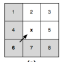
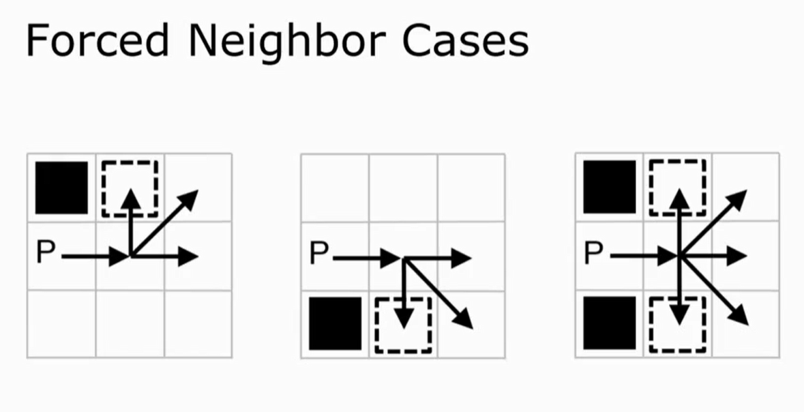

## 与Astar对比

通过寻找“跳点”，减少`OpenSet`集合的数量，从而达到减少遍历集。

所以搜索上JPS会比A* 快很多。但是由于一部分点都用一个点来表示， 路径表现上会感觉出寻路出的点并不是最优路径。

最终，如果需要实际应用，寻路出的点列表 需要二次修改，经过一些简单的规则,让路径看起来不那么怪异。

#### 减少添加到openset的数量

**剔除规则**

原始集合`neighbours`：当前点x的所有8个方向的邻居，

定义：`p(x)`为当前点`x`的来源节点，n∈neighbours。

满足条件即剔除掉：dist(p(x) -> x -> n) >= dist(p(x) -> 不经x -> n)。斜走花费√2̅， 直走花费1。

- 来源点与当前点连线为直线搜索示例：

  

  绿块为当前**搜索点(不直接加到OpenSet)**，绿块左边的点是它的**来源点(处于OpenSet中)**。当前搜索方向是**直线(注意，搜索方向唯一)**，所以会沿着当前方向一直搜索，直到走不下去，然后把最后一步的点加到OpenSet中。这样就减少了一路上经过的点加到OpenSet的过程，避免多余的寻径。

  补充或明：

   1. 灰色的格子代表不通过绿点去搜索的路径，因为不走绿点能更快到达，满足上述剔除公式。

   2. 走不下去的情况包括：遇到目标(直接使用此条搜索路径)；路径上出现障碍(整条搜索路径将被抛弃)；路径垂直方向遇到障碍（发散）。

      > ​	Q: 前两个都好理解，那么路径垂直方向遇到障碍1为什么不能走呢？
      >
      > ​	A: 根据剔除公式：此时，绿到紫的移动距离比其他方式更小，当前节点探索方向出现了**岔路**。所以把最后走到的绿点加到OpenSet中进行进一步遍历。
      >
      > ​	

- 来源点与当前点连线为对角搜索示例：

  

  我们注意到，在对角搜索的情况下会有三个方向需要去搜索（不想直线方向只要搜索一个朝向）。这个时候有个搜索优先级的问题：先直线后对角。

  

  在扩展紫色搜索路径的时候，发现了特殊情况

#### 减少了对称路径搜索

## JSP

### 图的特点

网格图，等边权。

### 三个概念

- 自然邻居

  没有被剔除规则剔除的节点。下图x代表当前节点，灰色的点都被剔除了。5号（图一），2/3/5号（图二）为自然邻居。

  

- 被迫邻居

  本该被剔除掉的节点，因为存在障碍物，使得该节点不满足剔除条件，而被保留下来。下图黑色方块为障碍物，虚线框即是被迫邻居。

  

- 跳点（目的是让搜索转向）

  基于`当前点X`，且`搜索方向为D`(斜向或水平或垂直)，`点Y`满足以下三个条件之一，那么`点y`就是跳点。

  1. `节点y`是终点，那么`节点y`是跳点。

  2. `节点y`**至少有一个被迫邻居**，那么`节点y`是跳点。

  3. 如果`搜索方向d`是**斜向搜索**，如果`节点y`的**水平或垂直方向**上有满足**条件1，2**的点，那么节点y是跳点。

     注：节点y的水平或垂直方向是斜向向量的拆解，比如向量d=(1,1)，那么水平方向则是(1,0)，并不会往左搜索，只会看右边，如果向量d=(-1,-1)，那么水平方向是(-1,0)，只会搜索左边，不看右边，其他同理。

### 找被迫邻居实现转向

先水平、垂直搜索节点，直到该节点为跳点，加入openlist；否则，斜向走一步再开启水平、垂直查找。

### 优先级

横纵向搜索 > 对角搜索

### 核心公式

作为入堆依据：g(y) = g(x) + dist(x,y)

意即：到达y点的距离 = 到达x点的距离 + xy之间的距离

### 算法思路

## 优化策略

**JPS-Bit**

用位运算加速跳点的寻找。将地图的每个格子编码为1个bit，因此1个int可以存储32个格子。然后利用CPU指令__builtin_clz找到32个格子里的跳点，因此寻找跳点的速度比遍历32个格子快几十倍。

**JPS-Prune**

利用剪枝剪掉非必需的“中间跳点”。“中间跳点”在节点拓展中只具有简单的承接作用，不具备拓展价值，剪枝“中间跳点”可以减少需要拓展的跳点数目，从而加速寻路。

**JPS-Pre**

利用预处理提前计算八方向的最大step, step为走到最近跳点、阻挡、边界的距离。JPS-Pre无须沿各方向寻找跳点，而是根据预处理的step快速确定跳点，从而加速寻路。

**--**

三种优化算法可以组合使用，实测中，JPS-Bit、JPS-BitPrune、JPS-BitPre、JPS-BitPrunePre寻路速度分别为A*算法的81倍、110倍、130倍、273倍。另外，将变量声明为thread_local可支持多线程寻路，但每个线程都拥有一个thread_local变量，会导致内存使用量显著增加，需要通过分层、内存池等方法优化内存。JPS寻找的路径在表现上并不是最优的路径，需要通过后处理对路径进行优化。

**JPS+ with goal bounding**

避免多余搜索路径，同时避免错误搜索方向（即始终朝向目标点）。特点：地图是静态的，因为需要预计算。