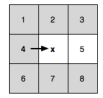
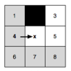
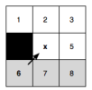

### 图的特点

网格图，等边权。

### 剔除规则

原始集合`neighbours`：当前点x的所有8个方向的邻居

定义：`p(x)`为当前点`x`的来源节点，n∈neighbours。

满足条件即剔除掉：dist(p(x) -> x -> n) >= dist(p(x) -> 不经x -> n)

### 三个概念

- 自然邻居

  没有被剔除规则剔除的节点。下图灰色的点都被剔除了。5号点为自然邻居。

  

- 被迫邻居

  本该被剔除掉的节点，因为存在障碍物，使得该节点不满足剔除条件，而被保留下来。下图黑色方块为障碍物。

  

- 跳点

  基于`当前点X`，且`搜索方向为D`(斜向或水平或垂直)，`点Y`满足以下三个条件之一，那么`点y`就是跳点。

  1. `节点y`是终点，那么`节点y`是跳点。

  2. `节点y`**至少有一个被迫邻居**，那么`节点y`是跳点。

  3. 如果`搜索方向d`是**斜向搜索**，如果`节点y`的**水平或垂直方向**上有满足**条件1，2**的点，那么节点y是跳点。

     注：节点y的水平或垂直方向是斜向向量的拆解，比如向量d=(1,1)，那么水平方向则是(1,0)，并不会往左搜索，只会看右边，如果向量d=(-1,-1)，那么水平方向是(-1,0)，只会搜索左边，不看右边，其他同理。
  
- 转向点

  

### 找被迫邻居实现转向

先水平、垂直搜索节点，直到该节点为跳点，加入openlist；否则，斜向走一步再开启水平、垂直查找。

### 优先级

横纵向搜索 > 对角sousuo

### 核心公式

g(y) = g(x) + dist(x,y)

意即：到达y点的距离 = 到达x点的距离 + xy之间的距离

### 算法思路

## 优化策略

### JPS+：

思路：预处理，减少层级递归寻找跳点