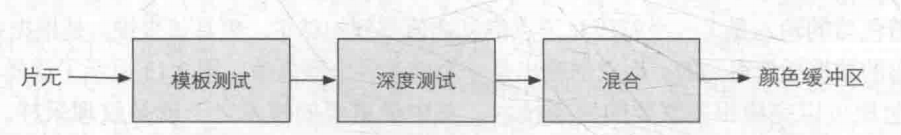
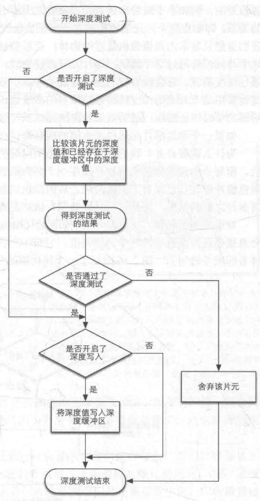

### 关键词

坐标系统，深度缓冲，深度值，

### 深度测试发生在什么阶段，流程如何

- 什么阶段：深度测试发生在光栅化阶段，具体在片段着色器之后的逐片段操作时。（不记得的回顾你好三角形）

  

- 做了什么：把片段的深度值和深度缓冲内容作对比，通过的话深度缓冲就会被更新，不通过就抛弃片段。

  

### 如何获取深度测试中所需的深度值

首先深度缓冲是在屏幕空间中运行的，所以所需的深度值需要通过屏幕空间坐标。以直接使用GLSL内建变量`gl_FragCoord`从**片段着色器**中直接访问。

所得为一个三元组，(x,y)代表片段屏幕空间坐标，z就是片段深度值。

### 提前深度测试与深度写入开关的注意点

提前深度测试是目前大部分GPU提供的一种硬件特性，它能够将确定被其他物体挡住的片段在片段着色器之前抛弃，从而优化性能；一旦开启了深度写入，这个特性就不能发挥了。

### 如何启用深度测试

```c++
glEnable(GL_DEPTH_TEST);
```

### 使用深度缓冲我们需要注意什么

```C++
//在每个渲染迭代之前清理缓冲
glClear(GL_COLOR_BUFFER_BIT | GL_DEPTH_BUFFER_BIT);
```

### 如何设置深度写入

```C++
glDepthMask(GL_FALSE); // 关闭
```

### 如何控制深度测试的比较

首先，深度测试是一个我们能控制的过程：

- 我们能决定哪些片段需要被丢弃

  ```C++
  glDepthFunc(GL_LESS); //默认情况
  ```

  `GL_LESS`代表片段深度值小于缓冲深度值时通过测试。另有一系列标记位可用。

### 深度值的映射涉及怎样的空间变换

首先要明确一点：深度值的取值范围在[0,1]之间，而深度值是由观察空间的`z值(可能是近平面到远平面的任意值)`经过变化映射到指定区间的。