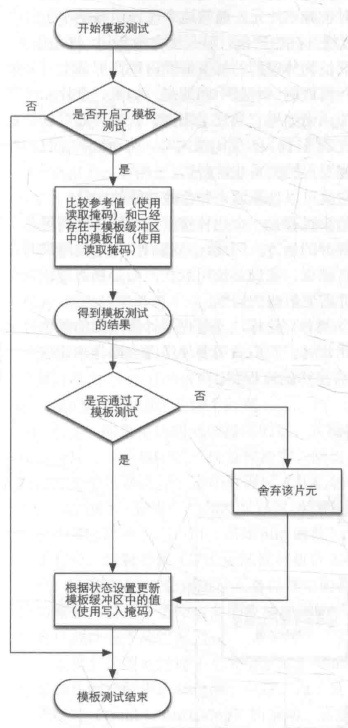

### 关键词

模板值， 模板缓冲， 

[TOC]

### 模板测试发生在什么阶段，流程如何

- 什么阶段：模板测试发生在光栅化阶段，具体在片段着色器之后的逐片段操作时。（不记得的回顾你好三角形）

  

- 做了什么：把片段的模板值和模板缓冲内容作对比，不通过就抛弃片段。

  

### 如何启用模板测试

```c++
glEnable(GL_STENCIL_TEST);
```

### 使用模板缓冲我们需要注意什么

```C++
//在每个渲染迭代之前清理缓冲
glClear(GL_COLOR_BUFFER_BIT | GL_DEPTH_BUFFER_BIT | GL_STENCIL_BUFFER_BIT);
```

### 如何设置模板值读写

```C++
glStencilMask(0xFF); // 每一位写入模板缓冲时都保持原样
glStencilMask(0x00); // 每一位在写入模板缓冲时都会变成0（禁用写入）
```

### 如何控制模板测试的比较

一共有两个函数能够用来配置模板测试：`glStencilFunc(决定抛弃哪些片段)`和`glStencilOp（如何更新模板值）`。

- ```C++
  //只要一个片段的模板值等于(GL_EQUAL)参考值1，片段将会通过测试并被绘制，否则会被丢弃
  glStencilFunc(GL_EQUAL, 1, 0xFF)
  ```

  GL_EQUAL是GLenum 类型的，它指定了比较符；1代表比较标准；0xFF 和 片段stencil值做 AND运算。

- ```C++
  glStencilOp(GLenum sfail, GLenum dpfail, GLenum dppass)
  ```

  - `sfail`：模板测试失败时采取的行为。
  - `dpfail`：模板测试通过，但深度测试失败时采取的行为。
  - `dppass`：模板测试和深度测试都通过时采取的行为。

### 用模板测试实现描边的流程及原理

- 在绘制（需要添加轮廓的）物体之前，将模板函数设置为GL_ALWAYS，每当物体的片段被渲染时，将模板缓冲更新为1。
- 渲染物体。
- 禁用模板写入以及深度测试。
- 将每个物体缩放一点点。
- 使用一个不同的片段着色器，输出一个单独的（边框）颜色。
- 再次绘制物体，但只在它们片段的模板值不等于1时才绘制。
- 再次启用模板写入和深度测试。

这样就能达到通过`stencil`值只绘制边缘的一部分，然后通过shader修改绘制出来部分的颜色，让边缘看起来像是描边一样。