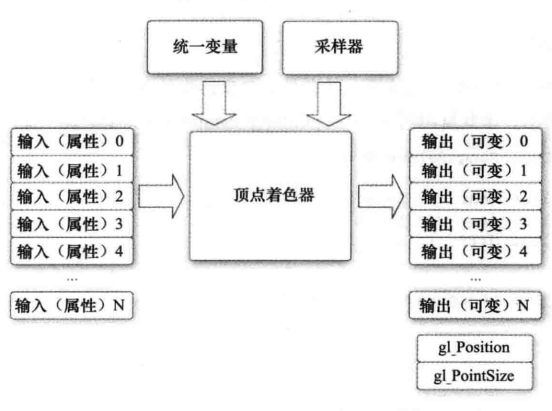

### 顶点着色器的组成？



- 着色器程序
- 顶点属性
- 输入属性即顶点属性
- 同一变量为着色器使用的不变数据

### 顶点着色器的作用

- 处理基于顶点的操作
  1. 矩阵变换
  2. 光照逐顶点颜色
  3. 操作纹理坐标
- 处理基于顶点的效果
  1. 执行自定义计算
  2. 实施新变换/照明

### 关于着色器的顶点输入是没有限制的？

着色器输入的顶点，具体来说是指顶点属性（vertex attribute)，能声明的输入数量是有限的，一般由硬件决定。可通过如下方式查询，但OpenGL会确保至少有16个4分量顶点属性可用。

```c
int iAttributes;
glGetIntegerv(GL_MAX_VERTEX_ATTRIBS,&iAttributes);
```

### 向量数据类型有什么特点？

xxvecn: xx代表基础数据类型（默认float）,例如 bvec1：包含一个bool分量的向量。 多使用vecn，因为float足够满足大多数要求了 。 一个向量的分量可以通过`vec.x`这种方式获取 。一个四分量顶点向量的格式是这样的：（x,y,z,w）；颜色：（r,g,b,a）；纹理：（s,t,p,q），也可以通过 **vec.xyz** 或 **vec.xxyy** 的类似方式（随意组合）一次获取一个**重组分量**。同时也可以把分量传入另一个分量的构造函数的参数列表中。

### 给顶点着色器指定顶点属性？

顶点着色器的输入特殊在，它从顶点数据中直接接收输入。为了定义顶点数据该如何管理，我们使用`location`这一元数据指定输入变量，这样我们才可以在CPU上配置顶点属性。 后续链接顶点属性时`glVertexAttribPointer`的第一个参数就是指 location 的值。

### 着色器之间传递数据需要注意什么？

类型和名字需要一致

### uniform是什么？

uniform是一种CPU向GPU发送数据的方式。uniform修饰的变量在着色器程序中是全局的，所以在着色器程序的任何阶段都可以访问修改它，并且数据将会一直保存直到被重置或更新。

```&gt;
//访问
# version 330 core
out vec4 fragmentcolor;
uniform vec4 uniformColor; 
int main(){
	fragmentcolor = color;
}
```

> 修改 
>
> - 用glGetUniformLocation（shaderProgram，“uniformColor”）找到uniform变量 
> - 用glUniform4f函数设置uniform值
>
> 注意点：
>
> - glGetUniformLocation返回-1表示没找到
> - glGetUniformLocation查询时不要求之前一定使用过着色器程序，但是**glUniform系列函数设（后面解释为什么说是系列函数）**置更新时却有这个要求。


注意，如果声明的uniform变量没有被用过，GLSL就会静默移除它，导致编译版本并不存在这个变量，这可能会导致一些问题。

### uniform修饰的变量是全局且到处可修改的吗？


    是全局的，可以被任何着色器程序在任意阶段修改。需要注意的是在修改他之前，需要通过glGetUniformLocation先获取他，然后通过glUniform系列函数中的一个指定修改他。

### 为什么说glUniform是系列函数？

因为它需要加上一个后缀：例如我需要修改的 uniform 变量是个四元组，那就要用 **glUniform4f**，这里的4表示参数个数；f 即float，代表数据类型。不同的组合显然能够组成一系列函数。 

###  OpenGL中的函数支持重载吗？

不支持。就比如之前的**glUniform**函数，其实他是一种操作，真正可使用的函数还需要在函数名还需要加上后缀（需求传参个数，传参类型），所以之前说glUniform是系列函数。

比如：glUniform4f：参数列表需要传入4个float参数